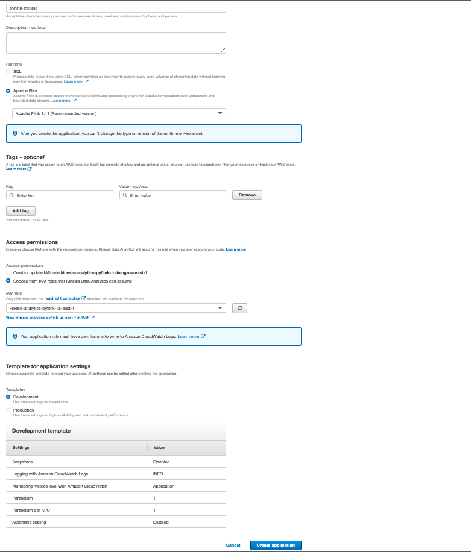

# Deploying

### Ensure you have completed or understand all the content within [packaging](../packaging/) before continuing.

## Steps
 
1. Navigate to the AWS Management Console in your browser and open up Amazon S3. Create a bucket or use an already existing one to store our archived zip file created in the *packaging* step.

2. Navigate to the IAM console and create a role with
   1. S3FullAccess
   2. CloudWatchFullAccess
   3. AmazonKinesis access to your input / output streams
   4. CloudWatchLogsFullAccess
   5. AmazonKinesisAnalyticsFullAccess 

3. Navigate to the Kinesis Analytics tab and click Create Application.
   1. Select Apache Flink 1.13 as the version
   2. Choose the IAM Role you have previously created
   3. Use the Development Template for Application Settings to reduce on costs. This will disable savepoints, reduce the granularity of metrics produced to CloudWatch, and set the application parallelism to `1`. For production workloads you will want different settings.

    

4. After clicking `Create Application`, the page should refresh, prompting you to `Configure` the application. This is where we will tell Kinesis Data Analytics where our `.zip` file is located, as well as how to load our lib files and our environment variables.

    Click `Configure`.

    - For `Amazon S3 Bucket`, locate the bucket you have placed your `.zip` file in, and select that bucket.
    - For `Path to Amazon S3 Object`, list the path--in my case, it's on the root--to the `GettingStarted.zip` file within the s3 bucket.

        
    
    Move down to the **Properties** section where we will basically copy the properties we've specified in our `application_properties.json` file locally.

    Click `Create group` and create a group called `kinesis.analytics.flink.run.options` with the following key value pairs:
    - `python`: `GettingStarted/getting-started.py`
    - `jarfile`: `GettingStarted/lib/flink-sql-connector-kinesis_2.12-1.13.2`

    The `python` key tells Kinesis Data Analytics for Apache Flink how to execute the file, and that it is a python application. It is the equivalent of locally typing `python getting-started.py` to execute the application.

    The `jarfile` key points to our lib folder dependencies, of which we have one. If you have mulitple, you can delimit them by a `;` semicolon character thusly:

    `dependency1.jar;dependency2.jar;dependency3.jar`

Please note this solution (CURRENTLY) only works locally--to achieve a pyFlink workload with multiple jarfile entries, you would need to create a single jar that contains all of the required dependencies.

    Click `Add group` to create our consumer properties:
    - GroupId: `consumer.config.0`
    - `input.stream.name`   : `input-stream`
    - `flink.stream.initpos`    : `LATEST`
    - `aws.region`  : `us-east-1`

    Click `Add group` again to create our producer properties:
    GroupId: `producer.config.0`
    - `output.stream.name`  : `output-stream`
    - `shard.count` : `1`
    -  `aws.region`  : `us-east-1`

    Some of there properties are in fact not being used by our pyflink application, but you can see how they may be used in the case where we need to update our region, shard count, etc and not need to modify the application code. Environment variables are extremely powerful in this case.

    Your finished **Properties** should look like this:
    

Click `Update`, and then...
## Hit `Run` to start your application!

You can select run without snapshot because we don't have any.

## When the application starts...
let's go back to our Pycharm IDE and start sending data through.

Navigate back to the `datagen/stock.py` file and rerun this.

Within a few minutes, navigate to the output Kinesis Data Stream. In the monitoring tab, you should see data being written to the stream.

## Nice work! 😎

Continue on to see how [logging in a Pyflink app works](../logging/), as well as some best practices around application development.
