# Getting Started

1. Install an IDE
   
   It is probably best for developing Python applications to use PyCharm, it's a really nice IDE with some nice Python functionality. That's what I'll include instructions for, but using IntelliJ will more or less be the same. Using VSCode is also great, however you will need to point your VSCode to the miniconda distribution we just installed. Should be straightforward.

   1. Go to the [Jetbrains Website to download](https://www.jetbrains.com/pycharm/download/)--use the Community edition because it's free!
   2. Select your operating system and download it, then run the executable to install.
   3. Open Pycharm

2. Set up IntelliJ or Pycharm with Conda
   1. When you first open up the IDE, do not import settings. Then select `GET FROM VCS`.

   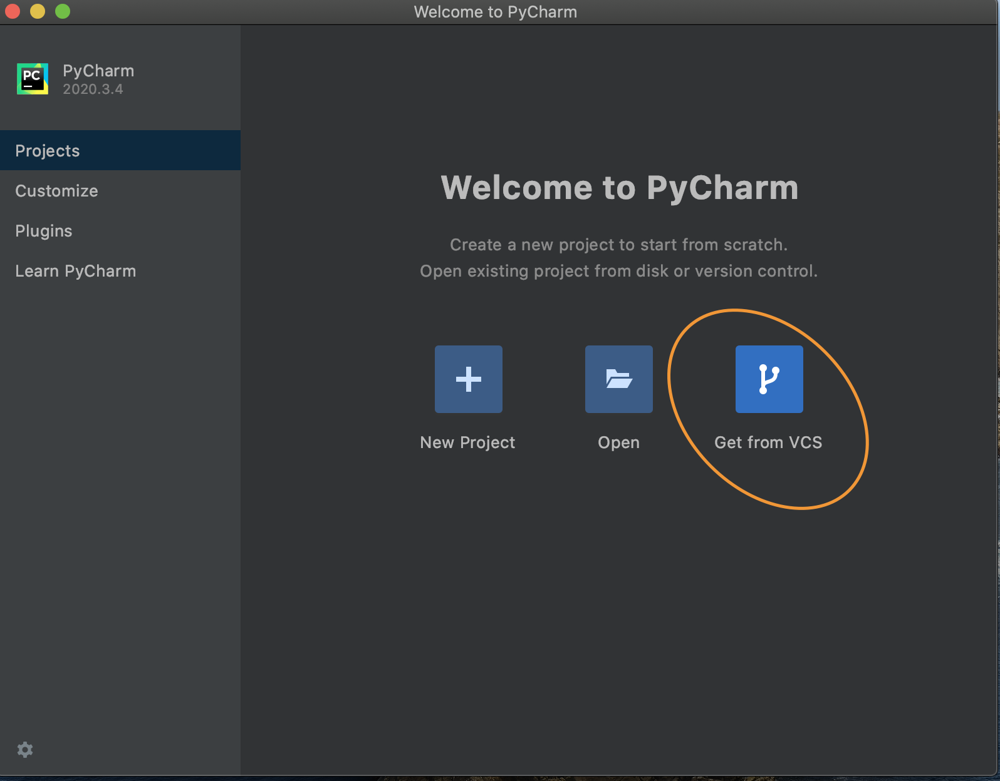

   2. In the URL box, enter in this repository's URL. (Clone URL)

   Save the project wherever you feel it would be appropriate, and the main IDE window will open.

   3. From here, let's configure our project to use the miniconda distribution we installed in step 1: 
      1. Pycharm > Preferences, Search for `Python Interpreter`, and change it to point to our path from step 1. You may need to click the `+` sign 

   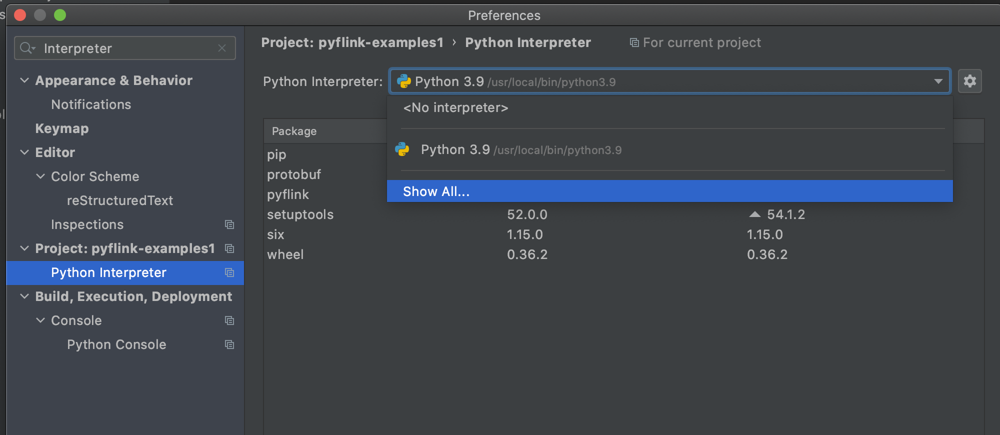

   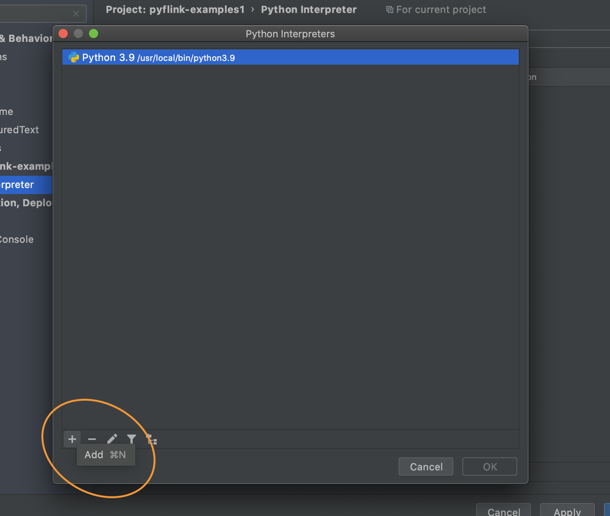

   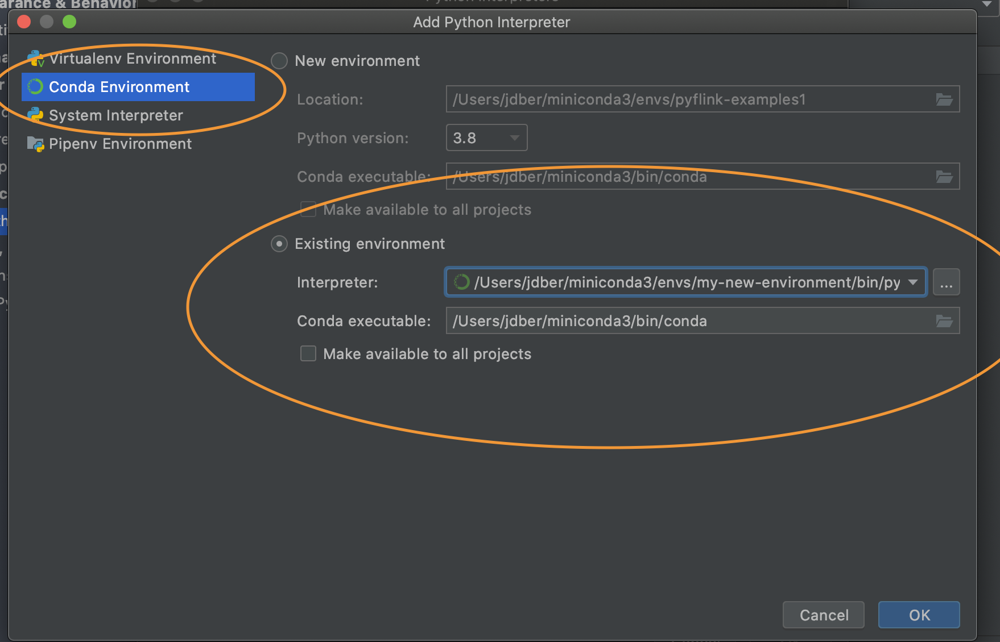

   Click okay, apply and close. You are now ready to start running through the examples!

3. Set up AWS Resources for local development
   1. Go into your AWS account and create an input Kinesis Data Stream and an Output Kineisis Data Stream--they can be one shard each, this is fine!

   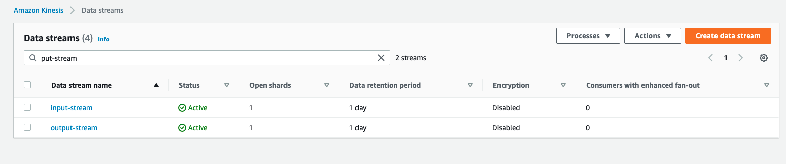

   2. Ensure you have the proper permissions to read / write to these streams through your IAM user locally. If not, you can use a local Kinesis engine like [Kinesalite](https://github.com/mhart/kinesalite) to simulate this.

4. Run the Getting Started example.

      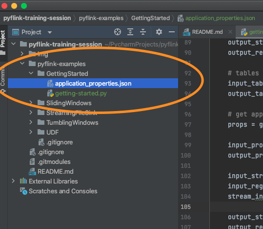

   1. Navigate to the GettingStarted folder within your project, and open the `application_properties.json` file to modify the following elements:

      On line 12, change the `input.stream.name` to be your input stream.

      On line 20, change the `output.stream.name` to be your output stream.
      
   Hit save.

      2. Click onto `getting-started.py` in the same folder as the `application_properties.json`, right click within the code and click `Modify Run Configuration`.

      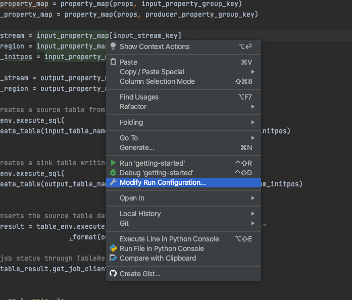

      This will open a dialog box where we can define our `IS_LOCAL` environment variable. We need this because I've written the script to use a local `application_properties.json` file if this switch is enabled! Without this, application will be looking in `/etc/flink/application_properties.json` which is where KDA places it.

      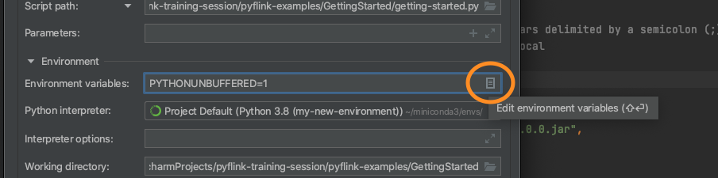
      Click on the icon next to Environment Variables which will open up another dialog box. In this one, on the bottom right you will see a `+` sign. Use this to add our `IS_LOCAL` environment variable.

      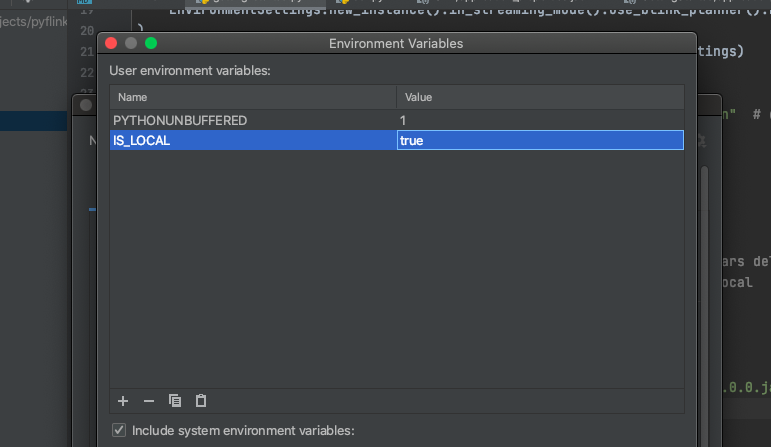

      Hit `OK`, then `Apply` and `OK`.

   3. Download and set up your Kinesis Connector.
   
   
      Create a folder within your GettingStarted application called `lib`, and download [the latest minor version of your Apache Flink Version flink-sql-connector jar file from this repo](https://mvnrepository.com/artifact/org.apache.flink/flink-sql-connector-kinesis) into it. It's the Amazon Kinesis SQL Connector for Flink. This will need to be bundled with your application on deploy, but ensure it's in your gitignore because adding jars to git is not a good practice.

      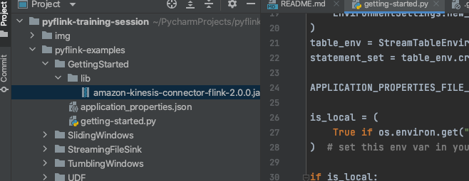

   4. Once this is all set up, we're ready to run our example! To go from Kinesis to Kinesis, no further modifications necessary. However, we'd like to see our results in the terminal. I've included a sample `print` connector for the sink, so let's swap out the second `create_table` function with `create_print_table`.

      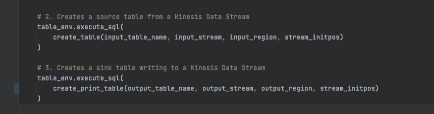

   5. Now, right click into the code and hit `Run 'getting-started'` to start the code execution.

   6. But wait! We need to send data to the stream. Go into the `datagen` folder in this project, open `stock.py`, right click and run this application as well to begin sending data to your application locally.

   You may need to install `boto3`-- Simply type `conda install boto3`.

   After a few seconds of sending data, you should see the print statements come through the console of the IDE in the `getting-started` tab.

   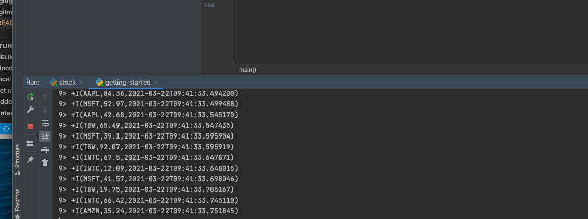

   Try out the other examples if you are interested! They are located in [pyflink-examples](../pyflink-examples)

   Continue on to [Packaging](../packaging/) to learn how to package your application for [Amazon Managed Service for Apache Flink](https://aws.amazon.com/managed-service-apache-flink/) (formerly known as Amazon Kinesis Data Analytics).
