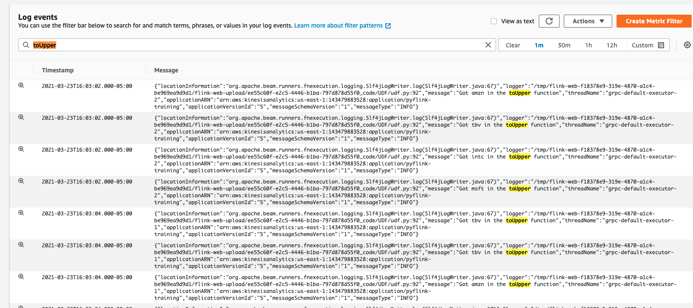

# Logging in a Pyflink Application

If you're thinking about logging every message within your Apache Flink application, please don't.

Logging, while useful for debugging an application, can be extremely detrimental to the Apache Flink Cluster's network threads and buffers, often resulting in backpressure and checkpointing failures over time.

That being said, if you must log, do so sparingly and in the case of exceptions in code, or one-time events like in the main function which runs on the Job Manager.

Let's look at how that works.


---------------------------

1. Open up your IDE and find the folder called `UDF` within the pyflink examples. Open the python file within this application called `udf.py`. This features the following UDF definition.

```python
import logging


@udf(input_types=[DataTypes.STRING()], result_type=DataTypes.STRING())
def to_upper(i):

    logging.info("Got {} in the toUpper function".format(str(i)))
    return i.upper()


table_env.register_function("to_upper",
                            to_upper)  # Deprecated in 1.12. Use :func:`create_temporary_system_function` instead.

````

This UDF will take in a string and convert it to all-uppercase. We are also logging every time we receive a message. Don't do this. Just do it for the practice!

You will also notice on line `143` we are selecting the ticker and calling the `to_upper` function upon it.


```python     
uppercase_ticker = input_table.select("to_upper(ticker), price, event_time")
```
--------------------------


2. Go ahead and follow the same procedure we did from before with the Getting Started application--add a `lib` folder and the kinesis-connector. You can copy it from your Getting Started folder if that makes it easier! 

When you're finished, the folder structure should look like:

```bash
UDF/
    lib/flink-sql-connector-kinesis_2.12-1.13.2
    application_properties.json
    udf.py
```

3. Zip up UDF into a file called UDF 
    ```bash
    zip -r UDF.zip UDF/   
    ```
4. Upload this file to S3 in the same bucket as before

5. Navigate back to the Kinesis Data Analytics Management Console and let's reconfigure our application in the following ways:

    ### Path to Amazon S3 Object:
    - Change to `UDF.zip`

    ### kinesis.analytics.flink.run.options (Properties)
     - Replace `GettingStarted` with `UDF` in all cases.
     - Change `getting-started.py` to `udf.py`
    (Select the group and click Edit Group)

    


Click `Update`, and the application will automatically restart picking up the new files.


6. Let's send some more data through. Go back to `stock.py` in your IDE and modify it to send some lower-case ticker values. You can add your name in all lower-case, or just modify the values it currently sends to be lower-case to see them be convered to uppercase. Ultimately it doesn't matter because we just want to see the logs!

    ```python
    def get_data():
        return {
            'event_time': datetime.datetime.now().isoformat(),
            'ticker': random.choice(['aapl', 'amzn', 'msft', 'intc', 'tbv']),
            'price': round(random.random() * 100, 2)	}
    ```
7. Within the Kinesis Data Analytics application, find the `Log stream` under the monitoring section and click into the `Log Stream` so we can look at the logs.

    


This will open up the CloudWatch logs where we can search for our UDF Logging Statements.


The logging statement is as follows:
```python
"Got {} in the toUpper function".format(str(i))
```

So we can search for the keyword `toUpper` to see the logs!




Pretty neat! (But don't do this)


| 🙅‍♂️ Logging within the main function is okay, and even upon handling exceptions. But logging every message can cause extreme backpressure.  |
|-----------------------------------------|

<br><br>
Continue on as we see how to [troubleshoot PyFlink applications.](../troubleshooting/)