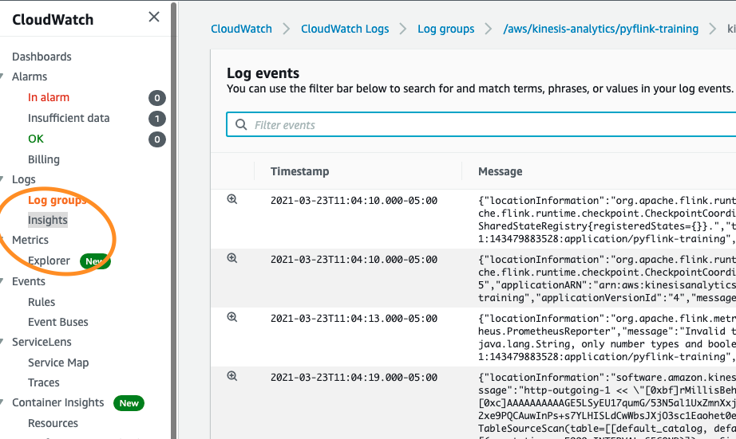
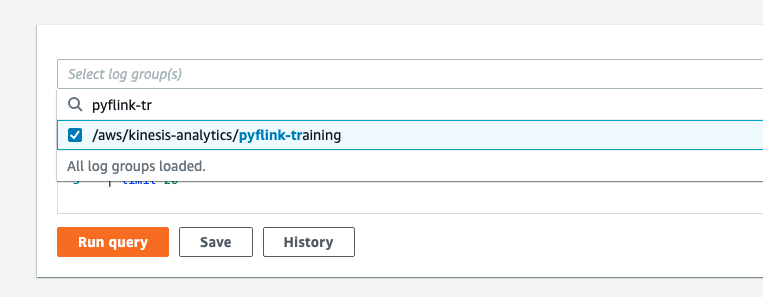
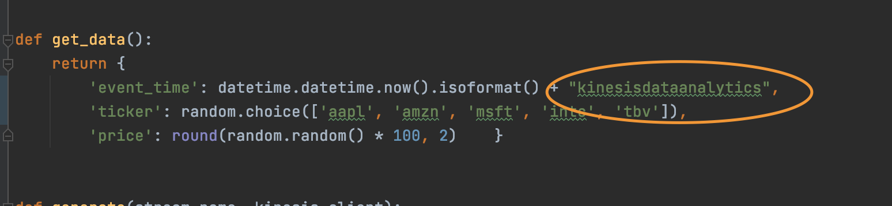

# Troubleshooting Pyflink Applications


Troubleshooting running Apache Flink applications can be challenging due to the distributed nature of the processing, the application logs being split between task managers and job managers, and the obfuscation of memory management within Apache Flink.

Kinesis Data Analytics helps immensely with this by centralizing the logs of the application in Amazon CloudWatch, and exporting metrics to CloudWatch metrics for fine-grained monitoring capabilities and integrations with other AWS services. 

## That being said,
If you can avoid troubleshooting your applications while they are running, it is preferred. This would be achieved by thoroughly testing your application both [locally](https://ci.apache.org/projects/flink/flink-docs-stable/dev/stream/testing.html) as well as performance testing in a production-like environment in terms of throughput and data representation.

Let's say you've done all that, and you've deployed your application to production, but now are experiencing issues?


Here are the steps you can take to check for errors in your application and potentially how to fix them:

1. Source / Sink errors
   - If you are receing **read / write throughput errors** in your *Kinesis Data Stream*, which you can identify by examining the Cloudwatch Metrics in your Kinesis Data Stream (Read / Write Throughput Exceeded Exception), it could be an indication that either the stream is underprovisioned, or that the way data is being written to the shards is causing hot shards. Take a look at each individual shard to eliminate this case.
   - Experiencing high read throughput but low write throughput to your sink? This could be an indication of **backpresure**, which you can use the Flink Dashboard to identify more thoroughly.
   - If using something like Apache Kafka, ensure that your cluster is provisioned to handle the throughput you are sending to the cluster.
2. User Exceptions
   1. To find user exceptions, let's navigate back to CloudWatch.
      - "But my application doesn't have any exceptions!"
        - More often than not, an application showing poor performance in checkpoints / reading from a stream are hints at the root cause, user exceptions. If nothing else, use this tactic to eliminate this from the list of possibilities.
    2. The easiest way to get back to your CloudWatch logs is to follow the steps we performed in the `logging` step:
       -  Within the Kinesis Data Analytics application, find the `Log stream` under the monitoring section and click into the `Log Stream` so we can look at the logs.

            

        From the page that opens, on the left hand side just below the current page, click the `Insights` tab.

        

    3. The CloudWatch Log Insights page makes it easier to filter for specific log messages within a Log Group.

        On the panel that says `Select log group(s)`, find the name of our application. In my case it's called `pyflink-training`.

        

        Once selected, we can perform a query to find any exceptions!

    4. In the demo, I'll send some invalid timestamps to the application to trigger some errors in the console.

        I'm going to add a random string to the end of the timestamp to trigger some exceptions.

        

        ### Sending some data through...

    5. And I should have gotten an exception by now. In the next bullet we'll look at how we can see this even sooner. But for now, go to CloudWatch Insights and enter the following in the query filter:

        ```SQL
        fields @timestamp,message
        | filter @message like /throwable/
        | sort @timestamp desc
        ```

        This will search for any message with the keyword `throwable`, which is an indication that the application has thrown an exception. 

        Found it!

        ```text
        java.time.format.DateTimeParseException: Text '2021-03-24T09:10:54.400986kinesisdataanalytics' could not be parsed, unparsed text found at index 26
        ```

    6. You can also perform searches like switching from Running to Restarting--that would look something like this:

        ```SQL
        fields @timestamp,@message
        | filter @message like /switched from RUNNING/
        | sort @timestamp desc
        ```
    
        And we can see the same messages come back.

        ```text
        switched from RUNNING to FAILED.","throwableInformation":"java.time.format.DateTimeParseException: Text '2021-03-24T09:10:54.400986kinesisdataanalytics' could not be parsed
        ```

<br>
-------------------------------------
<br>


There are two other relatively simple ways to troubleshoot and respond to events within your Apache Flink application running on Kinesis Data Analytics for Apache Flink.

The first being using CloudWatch metrics. Since this strategy doesn't differ too much from troubleshooting and monitoring Java / Scala Apache Flink applications, I will simply link to the documentation on that piece, along with using the Flink Dashboard to troubleshoot applications.


- ## [Advanced Monitoring using CloudWatch Metrics](https://streaming-analytics.workshop.aws/flink-on-kda/advanced-scale-and-monitor/monitoring/metrics-deep-dive.html)
- ## [Using the Flink Web Dashboard to identify issues with your applications](https://streaming-analytics.workshop.aws/flink-on-kda/advanced-scale-and-monitor/flink-dashboard.html)

**Please** review these for more details on how to properly monitor your Kinesis Data Analytics for Apache Flink application.

Any questions? File a Pull Request or Issue upon this repository for prompt feedback. Thanks!